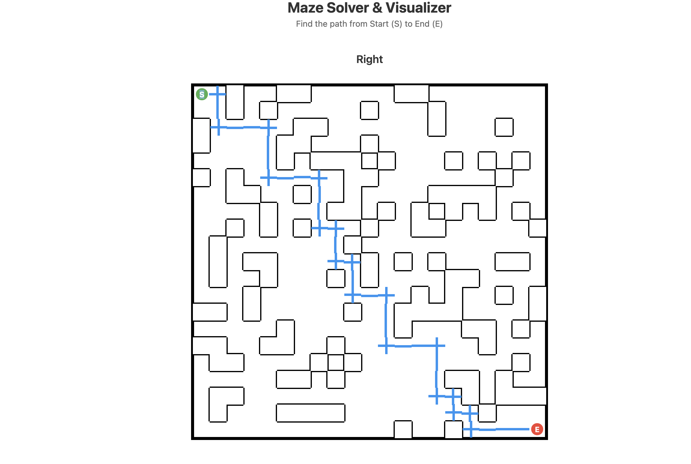
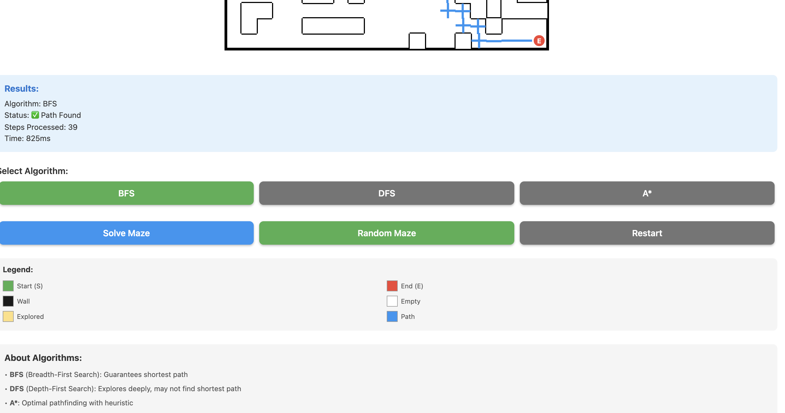

# 🧩 Maze Solver & Visualizer

A sophisticated React Native application that solves mazes using multiple pathfinding algorithms (BFS, DFS, A*) with beautiful real-time visualization.

## � Screenshots

<div align="center">
  


### Random Maze with Results


### Various Options


</div>

## �📋 About the Assignment

This project implements a complete maze-solving engine with the following capabilities:
- **Multiple Pathfinding Algorithms**: BFS (Breadth-First Search), DFS (Depth-First Search), and A* (A-star)
- **Real-time Visualization**: Watch the algorithms explore the maze and find the path
- **Grid-based Maze Representation**: 2D array structure with walls, paths, start, and end points
- **Dynamic Maze Generation**: Create random mazes or use predefined ones
- **Performance Metrics**: Track steps taken and time elapsed for each algorithm
- **Clean Separation of Concerns**: Pathfinding logic is completely separate from visualization

## ✨ Features

### Core Functionality
- ✅ Accept maze as 2D grid input
- ✅ Clearly marked Start (S) and End (E) points
- ✅ Three different pathfinding algorithms
- ✅ Respects maze constraints (walls, boundaries)
- ✅ Handles cases where no path exists
- ✅ Separate pathfinding logic from visualization

### Visualization
- ✅ Clear grid format display
- ✅ Visual distinction between walls, paths, start, and end
- ✅ Animated exploration of cells during traversal
- ✅ Highlighted final path from start to end
- ✅ Color-coded legend
- ✅ Performance statistics display

### User Controls
- 🎯 Algorithm selection (BFS, DFS, A*)
- 🔄 Reset maze to initial state
- 🎲 Generate random mazes
- ▶️ Solve maze with selected algorithm

## 🎯 Assumptions Made

1. **Maze Structure**:
   - Maze is represented as a 2D array where:
     - `0` = Empty/walkable cell
     - `1` = Wall/blocked cell
     - `2` = Start point (S)
     - `3` = End point (E)
   - Movement is allowed in 4 directions (up, down, left, right)
   - Diagonal movement is not allowed

2. **Algorithm Behavior**:
   - **BFS** guarantees the shortest path
   - **DFS** may not find the shortest path but explores deeply
   - **A*** uses Manhattan distance heuristic for optimal pathfinding

3. **Performance**:
   - Animation speed is set to 20ms per step for smooth visualization
   - Suitable for mazes up to 25x25 cells for optimal mobile experience

4. **User Experience**:
   - The app prevents multiple simultaneous operations
   - Visual feedback is provided through color changes and statistics
   - Alerts are shown for error cases (no path found, missing start/end)

## 🛠️ Technology Stack

- **Framework**: React Native 0.73.2
- **Language**: JavaScript (ES6+)
- **UI Components**: React Native Core Components
- **State Management**: React Hooks (useState, useCallback)
- **Algorithms**: Custom implementations of BFS, DFS, and A*

## 📁 Project Structure

```
Maze-Solver/
├── src/
│   ├── App.js                      # Main application component
│   ├── algorithms/
│   │   └── pathfinding.js          # BFS, DFS, A* implementations
│   ├── components/
│   │   ├── MazeGrid.js             # Maze grid visualization
│   │   ├── Legend.js               # Color legend component
│   │   └── Button.js               # Reusable button component
│   └── utils/
│       └── mazeUtils.js            # Maze utilities and generation
├── index.js                        # App entry point
├── package.json                    # Dependencies
├── babel.config.js                 # Babel configuration
├── metro.config.js                 # Metro bundler configuration
├── app.json                        # App metadata
├── .gitignore                      # Git ignore rules
├── README.md                       # This file
└── AI_PROMPTS.md                   # AI prompts used
```

## 🚀 Setup Instructions

### Prerequisites

Before you begin, ensure you have the following installed:
- **Node.js** (v18 or higher)
- **npm** or **yarn**
- **React Native CLI** (`npm install -g react-native-cli`)
- For iOS: **Xcode** (macOS only)
- For Android: **Android Studio** with Android SDK

### Installation Steps

1. **Clone the repository**:
   ```bash
   git clone <repository-url>
   cd Maze-Solver
   ```

2. **Install dependencies**:
   ```bash
   npm install
   # or
   yarn install
   ```

3. **iOS Setup** (macOS only):
   ```bash
   cd ios
   pod install
   cd ..
   ```

4. **Android Setup**:
   - Open Android Studio
   - Configure Android SDK (API level 33 or higher)
   - Set up an Android emulator or connect a physical device

## ▶️ Running the Project

### Start Metro Bundler

First, start the Metro bundler:
```bash
npm start
# or
yarn start
```

### Run on iOS (macOS only)

In a new terminal:
```bash
npm run ios
# or
yarn ios
```

To run on a specific iOS simulator:
```bash
npx react-native run-ios --simulator="iPhone 15 Pro"
```

### Run on Android

In a new terminal:
```bash
npm run android
# or
yarn android
```

Make sure you have an Android emulator running or a device connected via USB with USB debugging enabled.

### Run on Web (Experimental)

If you have Expo installed:
```bash
npm run web
# or
yarn web
```

## 🎮 How to Use

1. **Launch the app**: The app opens with a predefined maze
2. **Select an algorithm**: Choose between BFS, DFS, or A*
3. **Solve the maze**: Tap "Solve Maze" to watch the algorithm in action
4. **View results**: Check the statistics for steps taken and time elapsed
5. **Reset**: Tap "Reset" to clear the visualization and try again
6. **Random maze**: Tap "Random Maze" to generate a new maze
7. **Compare algorithms**: Try different algorithms on the same maze to compare performance

## 🎨 Color Coding

| Color | Meaning |
|-------|---------|
| 🟢 Green | Start Point (S) |
| 🔴 Red | End Point (E) |
| ⬛ Black | Wall (blocked) |
| ⬜ White | Empty (walkable) |
| 🟡 Yellow | Explored cells |
| 🔵 Blue | Final path |

## 🧮 Algorithm Comparison

| Algorithm | Guarantees Shortest Path | Time Complexity | Space Complexity | Best Use Case |
|-----------|-------------------------|-----------------|------------------|---------------|
| **BFS** | ✅ Yes | O(V + E) | O(V) | Unweighted shortest path |
| **DFS** | ❌ No | O(V + E) | O(V) | Exploring all paths |
| **A*** | ✅ Yes | O(b^d) | O(b^d) | Optimal pathfinding |

Where:
- V = number of vertices (cells)
- E = number of edges (connections)
- b = branching factor
- d = depth of solution

## 🐛 Troubleshooting

### Common Issues

1. **Metro bundler error**:
   ```bash
   npx react-native start --reset-cache
   ```

2. **Android build fails**:
   ```bash
   cd android
   ./gradlew clean
   cd ..
   npm run android
   ```

3. **iOS build fails**:
   ```bash
   cd ios
   pod deintegrate
   pod install
   cd ..
   npm run ios
   ```

4. **App crashes on launch**:
   - Clear app data
   - Rebuild the app
   - Check console logs for errors

## 📝 Code Quality

- ✅ Clean and readable code structure
- ✅ Meaningful variable and function names
- ✅ Comprehensive comments
- ✅ Separation of concerns (algorithms, UI, utilities)
- ✅ Reusable components
- ✅ Proper error handling
- ✅ Performance optimized

## 🤝 Contributing

This is an interview assignment project. However, suggestions and improvements are welcome!

## 📄 License

This project is created for educational purposes as part of an interview assignment.

## 👨‍💻 Author

Created with ❤️ using AI assistance (ChatGPT, Claude, GitHub Copilot)

## 🙏 Acknowledgments

- React Native community for excellent documentation
- Pathfinding algorithm implementations inspired by classic computer science texts
- UI design inspired by modern maze visualization tools

---

**Note**: This project demonstrates proficiency in:
- React Native development
- Algorithm implementation (BFS, DFS, A*)
- State management
- Component architecture
- Problem-solving skills
- Clean code practices
- Technical documentation
